# NΞØ Ecosystem Architecture — Complex Overview

Este documento descreve a ramificação técnica e estratégica do ecossistema NΞØ Smart Token Factory, detalhando como cada módulo evolui através das fases do roadmap.

## 🏗️ Estrutura de Ramificação

O ecossistema é dividido em 4 eixos principais que operam em paralelo:

### 1. CORE FORGE (Infraestrutura)
- **V0.5 (Ignição)**: `NeoTokenBase.sol`, Contratos auditáveis, Suporte Polygon/Base.
- **V0.6 (Oráculo)**: Hardening de segurança, Validação EVM via Regex, Mock Sandbox.
- **V0.8 (Kernel)**: Contratos Upgradáveis (Proxy), Lógica de Governança avançada.

### 2. NEURAL INTERFACE (UX/UI)
- **V0.5 (Ignição)**: Fábrica Smart Mint, Dashboard de Deploys.
- **V0.6 (Oráculo)**: **Ops Dashboard**, Protocol Intel Feed, Alertas dinâmicos.
- **V0.7 (Cult)**: Custom Asset Forge, Gerador visual de ecossistemas.

### 3. COMMAND CENTER (CLI & Ops)
- **V0.5 (Ignição)**: `init` & `deploy` base.
- **V0.6 (Oráculo)**: **Doctor CLI** (Diagnóstico), Health Checks automatizados via Actions.
- **V0.8 (Kernel)**: Singular CLI (`neo forge`), Orquestração total de builds.

### 4. NARRATIVE LAYER (Cult & AI)
- **V0.6 (Oráculo)**: Auditoria preditiva, Heurísticas de antifragilidade.
- **V0.7 (Cult)**: Manifesto Engine, Whitepapers dinâmicos, Ritualist API.

---

## 🛰️ Sincronização Cross-Repo (Smart Mint Protocol)

O protocolo de sincronização garante que a comunicação entre os repositórios siga a seguinte árvore:

```text
       [DOCUMENTAÇÃO] (Docs)
             ^
             | (make ops-sync)
             v
[CORE] <--> [OPS] <--> [UI]
  ^          ^          ^
  |          |          |
  +----------+----------+
             |
       [CLI COMMANDER]
```

## 🛤️ Roadmap Ramificado (2026)

| Fase | Infra (Core) | Interface (UI) | Lógica (AI/Ops) |
| :--- | :--- | :--- | :--- |
| **IGNIÇÃO** | Base Segura | Smart Mint v1 | CLI Deploy |
| **ORÁCULO** | Anti-fragilidade | Ops Dashboard | Doctor CLI |
| **CULT** | Governance | Asset Forge | Narrativa AI |
| **KERNEL** | Proxy/Multi-sig | Dashboard Pro | Singular CLI |
| **SINGULARIDADE** | DAO Autônomo | Neural Portal | Self-Dev Loop |

## 🗺️ Mapa de Evolução (Technical Blueprint)

```mermaid
graph TD
    %% Centro do Ecossistema
    ROOT["NΞØ CORE"]
    
    %% BRANCH 1: CORE FORGE
    ROOT ==> FORGE["CORE FORGE"]
    FORGE --> BASE["NeoTokenBase v0.5"]
    FORGE --> HARD["Security Hardening v0.5.3"]
    FORGE --> ORACLE["Auditoria Oráculo v0.6"]
    FORGE --> PROXY["Kernel Auto-Sync v0.8"]

    %% BRANCH 2: NEURAL INTERFACE
    ROOT ==> UI["NEURAL INTERFACE"]
    UI --> MINT["Smart Mint Factory"]
    UI --> OPS["Ops Dashboard v0.6"]
    UI --> INTEL["Protocol Intel Feed"]
    UI --> ASSET["Asset Forge v0.7"]

    %% BRANCH 3: COMMAND CENTER
    ROOT ==> CMD["COMMAND CENTER"]
    CMD --> DOCTOR["Doctor CLI Diagnostics"]
    CMD --> SYNC["Smart Mint Protocol"]
    CMD --> FLOW["Workflow Orchestration"]
    CMD --> SING["Singular CLI v0.8"]

    %% BRANCH 4: NARRATIVE LAYER
    ROOT ==> NARR["NARRATIVE LAYER"]
    NARR --> MANI["Manifesto Engine"]
    NARR --> DOCS_DYN["Dynamic Whitepapers"]
    NARR --> RITUAL["Ritualist API"]
    NARR --> AI_NARR["Neural Narrative AI"]

    %% Estilização (Compatível com Dark Mode)
    style ROOT fill:#D8F244,stroke:#000,stroke-width:4px,color:#000
    style FORGE fill:#111,stroke:#D8F244,color:#D8F244
    style UI fill:#111,stroke:#00E5FF,color:#00E5FF
    style CMD fill:#111,stroke:#D8F244,color:#D8F244
    style NARR fill:#111,stroke:#00E5FF,color:#00E5FF
```


