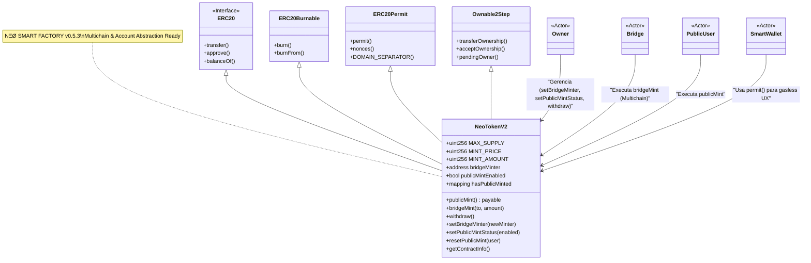

# NeoTokenV2 — Arquitetura Multichain & Account Abstraction

> **Versão**: v0.5.3  
> **Status**: ✅ Implementado  
> **Última atualização**: 20 de Janeiro de 2026

---

## 🎯 Visão Geral

O **NeoTokenV2** é a evolução do NeoTokenBase, projetado para o ecossistema Web3 moderno com suporte nativo para:
-**Account Abstraction** (gasless transactions via EIP-2612)
-**Arquitetura Multichain** (bridge-ready)
-**Proteção anti-bot** integrada
-**Supply cap** imutável

## 📊 Características Principais

### 1. ERC20Permit (EIP-2612)

Permite transações gasless via assinaturas off-chain:

```solidity
// Usuário assina off-chain, relayer executa on-chain
function permit(
    address owner,
    address spender,
    uint256 value,
    uint256 deadline,
    uint8 v,
    bytes32 r,
    bytes32 s
) external
```

**Casos de Uso:**
-✅ Onboarding sem ETH/POL para gas
-✅ Integração com Smart Wallets (Coinbase Smart Wallet, Safe, Argent)
-✅ UX simplificada para usuários não-técnicos
-✅ Aprovações gasless para DEXs e protocolos DeFi

**Exemplo de Integração:**
```javascript
// Frontend: usuário assina off-chain
const signature = await signer._signTypedData(domain, types, value);
const { v, r, s } = ethers.utils.splitSignature(signature);

// Relayer executa on-chain (usuário não paga gas)
await token.permit(owner, spender, amount, deadline, v, r, s);
await protocol.executeAction(owner); // Usa a aprovação
```

---

### 2. Bridge Minter Role

Sistema de mint autorizado para operações cross-chain:

```solidity
function bridgeMint(address _to, uint256 _amount) external {
    require(msg.sender == bridgeMinter, "Caller is not the bridge minter");
    require(_to != address(0), "Cannot mint to zero address");
    require(totalSupply() + _amount <= MAX_SUPPLY, "Max supply reached");
    
    _mint(_to, _amount);
    emit BridgeMinted(_to, _amount);
}
```

**Preparado para:**
-✅ **LayerZero** (omnichain messaging)
-✅ **Wormhole** (cross-chain bridge)
-✅ **Axelar** (cross-chain communication)
-✅ **Bridges customizadas** (contratos próprios)

**Fluxo Cross-Chain:**
```
Chain A (Polygon)          Bridge Contract          Chain B (Base)
     │                            │                        │
     │  1. User locks tokens      │                        │
     │─────────────────────────>  │                        │
     │                            │  2. Bridge verifies    │
     │                            │─────────────────────>  │
     │                            │                        │  3. bridgeMint()
     │                            │                        │     creates tokens
     │                            │  4. Confirmation       │
     │  <─────────────────────────│────────────────────── │
```

**Configuração:**
```solidity
// Owner configura o endereço da ponte
function setBridgeMinter(address _newMinter) external onlyOwner {
    require(_newMinter != address(0), "Invalid bridge minter");
    bridgeMinter = _newMinter;
    emit BridgeMinterUpdated(_newMinter);
}
```

---

### 3. Supply Cap & Anti-bot

```solidity
uint256 public constant MAX_SUPPLY = 1_000_000_000 * 10**18; // 1 bilhão
mapping(address => bool) public hasPublicMinted;
```

**Proteções:**
-✅ **Cap rígido**: Limite imutável de 1 bilhão de tokens
-✅ **Anti-sybil**: 1 mint público por wallet
-✅ **Validações**: Checks em `publicMint()` e `bridgeMint()`
-✅ **Emergência**: Função `resetPublicMint()` para casos edge

**Mint Público:**
```solidity
function publicMint() external payable {
    require(publicMintEnabled, "Public mint disabled");
    require(msg.value == MINT_PRICE, "Incorrect ETH/POL value");
    require(!hasPublicMinted[msg.sender], "Already minted");
    require(totalSupply() + MINT_AMOUNT <= MAX_SUPPLY, "Max supply reached");
    
    hasPublicMinted[msg.sender] = true;
    _mint(msg.sender, MINT_AMOUNT);
    
    emit PublicMinted(msg.sender, MINT_AMOUNT, msg.value);
}
```

---

### 4. Eventos Completos

```solidity
event PublicMinted(address indexed minter, uint256 amount, uint256 pricePaid);
event BridgeMinted(address indexed to, uint256 amount);
event BridgeMinterUpdated(address indexed newMinter);
event PublicMintStatusChanged(bool enabled);
```

**Indexação:**
-✅ **The Graph**: Subgraphs para queries GraphQL
-✅ **Dune Analytics**: Dashboards e analytics
-✅ **Exploradores**: PolygonScan, Basescan, Etherscan

**Exemplo de Subgraph (The Graph):**
```graphql
type PublicMint @entity {
  id: ID!
  minter: Bytes!
  amount: BigInt!
  pricePaid: BigInt!
  timestamp: BigInt!
  transactionHash: Bytes!
}

type BridgeMint @entity {
  id: ID!
  recipient: Bytes!
  amount: BigInt!
  timestamp: BigInt!
  transactionHash: Bytes!
}
```

---

## 🔗 Diagrama de Conexões



---

## 💼 Casos de Uso

### 1. Mint Público (Ritual de Ignição)

```solidity
// Usuário paga MINT_PRICE e recebe MINT_AMOUNT
await token.publicMint({ value: ethers.parseEther("0.003") });
```

**Cenário:**
-Lançamento de token com distribuição inicial justa
-Cada wallet pode mintar apenas 1 vez
-Preço fixo definido no deploy

---

### 2. Bridge Cross-Chain

```solidity
// Bridge autorizada minta na chain de destino
await token.bridgeMint(userAddress, amount);
```

**Cenário:**
-Usuário bloqueia tokens na Chain A
-Bridge verifica e minta na Chain B
-Supply total permanece constante (burn na origem)

---

### 3. Integração Frontend

```solidity
// Obter todas as informações do contrato em uma única chamada
const info = await token.getContractInfo();
// Returns: [currentSupply, maxSupply, mintPrice, mintAmount, mintEnabled, bridgeAddress]
```

**Exemplo React:**
```javascript
const TokenInfo = () => {
  const [info, setInfo] = useState(null);
  
  useEffect(() => {
    const fetchInfo = async () => {
      const [supply, maxSupply, price, amount, enabled, bridge] = 
        await contract.getContractInfo();
      
      setInfo({
        currentSupply: ethers.formatEther(supply),
        maxSupply: ethers.formatEther(maxSupply),
        mintPrice: ethers.formatEther(price),
        mintAmount: ethers.formatEther(amount),
        mintEnabled: enabled,
        bridgeAddress: bridge
      });
    };
    
    fetchInfo();
  }, []);
  
  return (
    <div>
      <p>Supply: {info?.currentSupply} / {info?.maxSupply}</p>
      <p>Mint Price: {info?.mintPrice} POL</p>
      <p>Status: {info?.mintEnabled ? "Open" : "Closed"}</p>
    </div>
  );
};
```

---

### 4. Gasless Approval (Account Abstraction)

```javascript
// Usuário assina off-chain (sem gas)
const domain = {
  name: await token.name(),
  version: '1',
  chainId: await signer.getChainId(),
  verifyingContract: token.address
};

const types = {
  Permit: [
    { name: 'owner', type: 'address' },
    { name: 'spender', type: 'address' },
    { name: 'value', type: 'uint256' },
    { name: 'nonce', type: 'uint256' },
    { name: 'deadline', type: 'uint256' }
  ]
};

const value = {
  owner: userAddress,
  spender: protocolAddress,
  value: amount,
  nonce: await token.nonces(userAddress),
  deadline: Math.floor(Date.now() / 1000) + 3600 // 1 hora
};

const signature = await signer._signTypedData(domain, types, value);
const { v, r, s } = ethers.utils.splitSignature(signature);

// Relayer executa on-chain (relayer paga gas, não o usuário)
await token.permit(userAddress, protocolAddress, amount, deadline, v, r, s);
```

---

## 🔒 Segurança

### Padrões Implementados

-✅ **Ownable2Step**: Transferência segura de ownership (evita erros de digitação)
-✅ **Withdraw via `call{}`**: Evita falhas com contratos que rejeitam `transfer()`
-✅ **Validações de zero address**: Previne mint/configuração para endereço nulo
-✅ **Supply cap imutável**: Não pode ser alterado após deploy
-✅ **Reentrancy protection**: Design seguro (checks-effects-interactions)

### Auditoria

-**Base**: OpenZeppelin Contracts v5.0 (auditado por Trail of Bits, Consensys Diligence)
-**Herança**: ERC20, ERC20Burnable, ERC20Permit (padrões da indústria)
-**Custom**: Validações adicionais em mint functions

### Checklist de Segurança

-[x] Supply cap imutável
-[x] Validações de zero address
-[x] Ownable2Step para ownership
-[x] Withdraw seguro via call{}
-[x] Eventos para todas as ações críticas
-[x] Anti-bot integrado
-[x] Bridge minter role com validações

---

## 🚀 Deployment

### Parâmetros do Constructor

```solidity
constructor(
    string memory name,           // Nome do token (ex: "Neo Protocol")
    string memory symbol,         // Símbolo (ex: "NEO")
    uint256 mintPrice,           // Preço do mint público em wei
    uint256 mintAmount,          // Quantidade de tokens por mint
    address initialOwner         // Owner inicial (Ownable2Step)
)
```

### Exemplo de Deploy (Hardhat)

```javascript
const { ethers } = require("hardhat");

async function main() {
  const [deployer] = await ethers.getSigners();
  
  console.log("Deploying NeoTokenV2 with account:", deployer.address);
  
  const NeoTokenV2 = await ethers.getContractFactory("NeoTokenV2");
  const token = await NeoTokenV2.deploy(
    "Neo Protocol",                    // name
    "NEO",                             // symbol
    ethers.parseEther("0.003"),          // mintPrice: 0.003 ETH
    ethers.parseEther("1000"),         // mintAmount: 1000 tokens
    deployer.address                   // initialOwner
  );
  
  await token.waitForDeployment();
  
  console.log("NeoTokenV2 deployed to:", await token.getAddress());
  
  // Configurar bridge (opcional)
  if (process.env.BRIDGE_ADDRESS) {
    await token.setBridgeMinter(process.env.BRIDGE_ADDRESS);
    console.log("Bridge minter set to:", process.env.BRIDGE_ADDRESS);
  }
}

main()
  .then(() => process.exit(0))
  .catch((error) => {
    console.error(error);
    process.exit(1);
  });
```

### Exemplo de Deploy (Foundry)

```bash
forge create src/NeoTokenV2.sol:NeoTokenV2 \
  --rpc-url $RPC_URL \
  --private-key $PRIVATE_KEY \
  --constructor-args \
    "Neo Protocol" \
    "NEO" \
    100000000000000000 \
    1000000000000000000000 \
    $OWNER_ADDRESS \
  --verify \
  --etherscan-api-key $ETHERSCAN_API_KEY
```

---

## 🗺️ Roadmap de Integração

### Fase 1: Base (✅ Implementado)
-[x] Contrato NeoTokenV2
-[x] Documentação completa
-[x] Eventos e view functions
-[x] Deploy scripts

### Fase 2: Multichain (🔨 Em Planejamento)
-[ ] Integração LayerZero OFT (Omnichain Fungible Token)
-[ ] Deploy em múltiplas chains (Polygon, Base, Arbitrum, Optimism)
-[ ] Bridge UI para usuários
-[ ] Subgraph para indexação cross-chain

### Fase 3: AA Integration (📋 Futuro)
-[ ] SDK para Smart Wallets
-[ ] Gasless mint via relayers
-[ ] Integração Coinbase Smart Wallet
-[ ] Paymaster para subsidiar gas

### Fase 4: DeFi Integration (📋 Futuro)
-[ ] Pools de liquidez (Uniswap V3)
-[ ] Staking contracts
-[ ] Governance (snapshot.org)
-[ ] Vesting schedules

---

## 📚 Referências

### Padrões (EIPs)
-[EIP-20: ERC20 Token Standard](<https://eips.ethereum.org/EIPS/eip-20>)
-[EIP-2612: Permit Extension for ERC20](<https://eips.ethereum.org/EIPS/eip-2612>)
-[EIP-4337: Account Abstraction](<https://eips.ethereum.org/EIPS/eip-4337>)

### OpenZeppelin
-[ERC20 Documentation](<https://docs.openzeppelin.com/contracts/5.x/erc20>)
-[ERC20Permit Documentation](<https://docs.openzeppelin.com/contracts/5.x/api/token/erc20#ERC20Permit>)
-[Ownable2Step Documentation](<https://docs.openzeppelin.com/contracts/5.x/api/access#Ownable2Step>)

### Bridges
-[LayerZero Documentation](<https://layerzero.network/developers>)
-[Wormhole Documentation](<https://docs.wormhole.com/>)
-[Axelar Documentation](<https://docs.axelar.dev/>)

### Indexação
-[The Graph Documentation](<https://thegraph.com/docs/>)
-[Dune Analytics](<https://dune.com/docs/>)

---

## 🤝 Contribuindo

Para sugestões de melhorias ou bugs, abra uma issue no repositório.

---

**Versão**: v0.5.3 — MULTICHAIN FOUNDATION  
**License**: MIT

---

### 👤 Autoria

**Project Lead**: NODE NEØ  
**Email**: neo@neoprotocol.space  
**Web3 Identity**: neoprotocol.eth  
**NEØ PROTOCOL**: https://neoprotocol.space  
[](https://github.com/neo-smart-token-factory)

> *Expand until silence becomes structure.*

