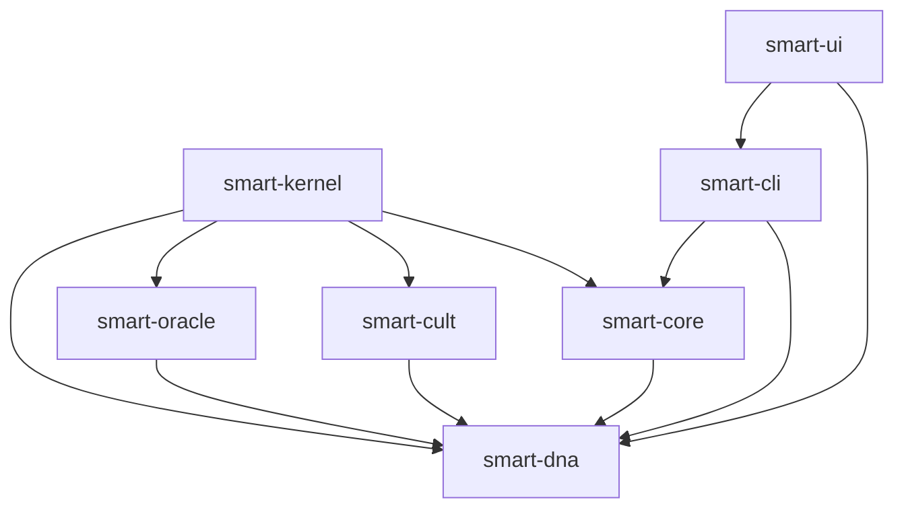

# 🏗️ Arquitetura — NΞØ SMART FACTORY

> **⚠️ DOCUMENTO DE PLANEJAMENTO FUTURO**  
> Este documento descreve a **arquitetura multi-repo planejada** para versões futuras.  
> **Estrutura atual (v0.5.1)**: Monorepo com `forge-core/`, `forge-ui/`, `forge-cli/`  
> **Veja**: [Nomenclatura](../../NOMENCLATURA.md) para estrutura atual | [Relatório de Auditoria](../RELATORIO_AUDITORIA.md) para comparação

---

## 🎯 Topologia do Ecossistema Modular (Proposta Futura)

---

## 🎯 Princípios de Design

### Modularidade Radical
Cada componente é **independente, testável e publicável**.

### Single Responsibility
Cada repositório tem **uma responsabilidade clara**.

### Composabilidade
Componentes podem ser **combinados ou usados isoladamente**.

### Versionamento Independente
Cada módulo tem seu **próprio ciclo de vida**.

---

## 🧩 Arquitetura Multi-Repo

```
NΞØ SMART FACTORY Ecosystem
│
├─ Core Layer (Blockchain)
│  └─ smart-core/              → Contratos, scripts, templates
│
├─ Interface Layer (User)
│  ├─ smart-ui/                → PWA, landing, formulário
│  └─ smart-cli/               → CLI universal (nxf)
│
├─ Intelligence Layer (AI)
│  ├─ smart-oracle/            → Refinamento via LLM
│  └─ smart-cult/              → Geração de narrativa
│
├─ Data Layer (Schema)
│  └─ smart-dna/               → Schema JSON + validação
│
├─ Orchestration Layer (Automation)
│  └─ smart-kernel/            → Orquestrador 1-click
│
└─ Documentation Layer
   └─ docs/                    → Documentação viva
```

---

## 📦 Repositórios — Detalhamento

### 🔥 smart-core/

**Responsabilidade:** Blockchain, contratos, deploy  
**Linguagem:** Solidity, JavaScript  
**Dependências:** Hardhat, OpenZeppelin

**Estrutura:**
```
smart-core/
├── contracts/
│   ├── NeoTokenBase.sol
│   ├── IgnitionToken.sol
│   └── NeoSmartFactory.sol
├── scripts/
│   ├── deploy.js
│   ├── verify.js
│   └── simulate.js
├── templates/
│   ├── token.sol.template
│   └── manifest.template.md
├── test/
│   └── ignition.test.js
└── hardhat.config.js
```

**NPM Package:** `@neosmart/core`  
**Versão Atual:** v0.5.1

---

### 🎨 smart-ui/

**Responsabilidade:** Interface visual, PWA  
**Linguagem:** Vue.js, Nuxt.js, React  
**Dependências:** Tailwind, Vite

**Estrutura:**
```
smart-ui/
├── landing/                   → React + Vite
│   ├── src/
│   └── public/
├── nuxt-app/                  → PWA Nuxt.js
│   ├── pages/
│   ├── components/
│   └── composables/
└── shared/
    └── components/
```

**NPM Package:** `@neosmart/ui`  
**Versão Atual:** v0.5.1

**Deploy:**
- Landing: Vercel
- PWA: Vercel/Netlify

---

### ⚡ smart-cli/

**Responsabilidade:** CLI universal, comandos  
**Linguagem:** JavaScript/TypeScript  
**Dependências:** Commander.js, Inquirer

**Estrutura:**
```
smart-cli/
├── bin/
│   └── nxf.js                 → Executável principal
├── commands/
│   ├── init.js
│   ├── deploy.js
│   ├── simulate.js
│   └── status.js
├── lib/
│   ├── utils.js
│   └── logger.js
└── templates/
```

**NPM Package:** `@neosmart/cli` ou `nxf`  
**Versão Atual:** v0.5.1

**Instalação:**
```bash
npm install -g nxf
# ou
npx nxf@latest init
```

---

### 🔮 smart-oracle/

**Responsabilidade:** Refinamento inteligente via LLM  
**Linguagem:** TypeScript  
**Dependências:** OpenAI SDK, Anthropic SDK

**Estrutura:**
```
smart-oracle/
├── prompts/
│   ├── refine.prompt.md
│   ├── security.prompt.md
│   └── tokenomics.prompt.md
├── heuristics/
│   ├── antifragility.ts
│   └── validation.ts
├── core/
│   ├── questioner.ts
│   └── analyzer.ts
└── integrations/
    ├── openai.ts
    └── anthropic.ts
```

**NPM Package:** `@neosmart/oracle`  
**Versão Planejada:** v0.6.0 (Fev 2025)

**API:**
```typescript
import { Oracle } from '@neosmart/oracle'

const oracle = new Oracle({ provider: 'gpt-4' })
const refinedDNA = await oracle.refine(rawDNA)
```

---

### 📖 smart-cult/

**Responsabilidade:** Geração de narrativa/documentos  
**Linguagem:** TypeScript  
**Dependências:** Templates, LLM SDKs

**Estrutura:**
```
smart-cult/
├── generators/
│   ├── manifesto.ts
│   ├── whitepaper.ts
│   ├── pitchdeck.ts
│   └── rituals.ts
├── templates/
│   ├── manifesto.md
│   └── whitepaper.md
└── core/
    └── engine.ts
```

**NPM Package:** `@neosmart/cult`  
**Versão Planejada:** v0.7.0 (Mar 2025)

**API:**
```typescript
import { Cult } from '@neosmart/cult'

const cult = new Cult()
const manifesto = await cult.generateManifesto(dna)
const whitepaper = await cult.generateWhitepaper(dna)
```

---

### 🧬 smart-dna/

**Responsabilidade:** Schema, validação, templates  
**Linguagem:** TypeScript, JSON Schema  
**Dependências:** Zod, AJV

**Estrutura:**
```
smart-dna/
├── schema/
│   ├── dna.schema.json
│   ├── dna.schema.ts
│   └── validation.ts
├── templates/
│   ├── minimal.json
│   ├── complete.json
│   └── examples/
└── lib/
    ├── validator.ts
    └── generator.ts
```

**NPM Package:** `@neosmart/dna`  
**Versão Planejada:** v0.6.0 (Fev 2025)

**API:**
```typescript
import { DNA } from '@neosmart/dna'

const dna = DNA.parse(jsonData)
const isValid = DNA.validate(dna)
```

---

### 🎛️ smart-kernel/

**Responsabilidade:** Orquestração, pipeline completo  
**Linguagem:** TypeScript  
**Dependências:** Todos os outros módulos

**Estrutura:**
```
smart-kernel/
├── core/
│   ├── orchestrator.ts
│   └── pipeline.ts
├── workflows/
│   ├── oneclick.ts
│   └── advanced.ts
└── config/
    └── kernel.config.ts
```

**NPM Package:** `@neosmart/kernel`  
**Versão Planejada:** v0.8.0 (Abr 2025)

**API:**
```typescript
import { Kernel } from '@neosmart/kernel'

const kernel = new Kernel()
await kernel.forge({
  dna: './my-token.json',
  mode: 'oneclick',
  network: 'polygon'
})
```

---

### 📚 docs/

**Responsabilidade:** Documentação centralizada  
**Linguagem:** Markdown  
**Tecnologia:** VitePress, Docusaurus

**Estrutura:**
```
docs/
├── guide/
│   ├── getting-started.md
│   ├── first-deploy.md
│   └── advanced.md
├── api/
│   ├── core.md
│   ├── oracle.md
│   └── cult.md
├── architecture/
│   ├── overview.md
│   └── repos.md
└── .vitepress/
    └── config.ts
```

**Hospedagem:** GitHub Pages / Vercel  
**URL:** docs.neosmart.factory

---

## 🔄 Fluxo de Dados

### Modo One-Click (v0.8.0+)

```
User Input (UI/CLI)
      ↓
  smart-dna (validação)
      ↓
  smart-oracle (refinamento)
      ↓
  smart-cult (narrativa)
      ↓
  smart-core (contratos)
      ↓
  smart-core (deploy)
      ↓
  Output (contrato + docs)
```

### Modo Atual (v0.5.1)

```
User Input (UI/CLI)
      ↓
  smart-cli (init)
      ↓
  Manual configuration
      ↓
  smart-core (deploy)
      ↓
  Output (contrato)
```

---

## 🔗 Dependências Entre Módulos



**Legenda:**

- `smart-kernel` depende de todos os módulos
- `smart-cli` é intermediário entre UI e Core
- `smart-dna` é dependência compartilhada
- `smart-ui` usa CLI e DNA

---

## 📊 Versionamento

### Estratégia

**Semantic Versioning (semver):**

- `v0.x.x` → Alpha/Beta (breaking changes permitidos)
- `v1.x.x` → Estável (breaking changes só em major)

**Independência:**

- Cada repo tem sua própria versão
- Kernel especifica versões compatíveis

**Exemplo:**

```json
{
  "dependencies": {
    "@neosmart/core": "^0.5.1",
    "@neosmart/dna": "^0.6.0",
    "@neosmart/oracle": "^0.6.0"
  }
}
```

---

## 🚀 Publicação

### NPM Packages

| Package | Scope | Público? |
|---------|-------|----------|
| `@neosmart/core` | Core contracts | ✅ Sim |
| `@neosmart/ui` | UI components | ✅ Sim |
| `@neosmart/cli` ou `nxf` | CLI tool | ✅ Sim |
| `@neosmart/oracle` | Oracle engine | ✅ Sim |
| `@neosmart/cult` | Content generation | ✅ Sim |
| `@neosmart/dna` | Schema & validation | ✅ Sim |
| `@neosmart/kernel` | Orchestrator | ✅ Sim |

### GitHub Organization

```
github.com/neo-smart-token-factory/
├── smart-core
├── smart-ui
├── smart-cli
├── smart-oracle
├── smart-cult
├── smart-dna
├── smart-kernel
└── docs
```

---

## 🛠️ Desenvolvimento

### Workflow

**1. Clone completo:**

```bash
# Script automático (futuro)
npx nxf clone-all

# Ou manual:
git clone git@github.com:neo-smart-token-factory/smart-core.git
git clone git@github.com:neo-smart-token-factory/smart-ui.git
git clone git@github.com:neo-smart-token-factory/smart-cli.git
# ...
```

**2. Desenvolvimento isolado:**

```bash
cd smart-core
npm install
npm test
npm run build
```

**3. Integração:**

```bash
cd smart-kernel
npm link ../smart-core
npm link ../smart-oracle
npm test
```

---

## 🧪 Testing

### Por Repositório

Cada repo tem seus próprios testes:

```bash
smart-core/     → Hardhat tests (Solidity)
smart-oracle/   → Jest/Vitest (TypeScript)
smart-cult/     → Jest/Vitest (TypeScript)
smart-cli/      → Jest (CLI tests)
```

### Integração

`smart-kernel` testa integração entre módulos:

```bash
cd smart-kernel
npm run test:integration
```

---

## 📦 Deploy

### Contratos (smart-core)
```bash
cd smart-core
npm run deploy:polygon
npm run verify
```

### UI (smart-ui)
```bash
cd smart-ui/landing
vercel deploy --prod

cd smart-ui/nuxt-app
vercel deploy --prod
```

### CLI (smart-cli)
```bash
cd smart-cli
npm publish --access public
```

---

## 🔐 Segurança

### Repositórios Privados vs Públicos

**Públicos:**
- ✅ Todos os repos (open source)

**Privados (se necessário):**
- 🔒 `smart-kernel` (até v1.0.0)
- 🔒 Configurações sensíveis

### Secrets Management

**Cada repo tem seus secrets no GitHub Actions:**
- `PRIVATE_KEY` (deploy)
- `POLYGONSCAN_API_KEY` (verify)
- `NPM_TOKEN` (publish)
- `OPENAI_API_KEY` (oracle)

---

## 📈 Roadmap de Migração

### Fase 1 — Separação Básica (Dez 2024)
- [x] `smart-core` separado
- [x] `smart-ui` separado
- [x] `smart-cli` separado
- [ ] NPM packages publicados

### Fase 2 — Inteligência (Jan-Mar 2025)
- [ ] `smart-oracle` criado (v0.6.0)
- [ ] `smart-dna` completo (v0.6.0)
- [ ] `smart-cult` criado (v0.7.0)

### Fase 3 — Orquestração (Abr-Mai 2025)
- [ ] `smart-kernel` criado (v0.8.0)
- [ ] Pipeline completo (v1.0.0)
- [ ] Documentação unificada

---

## 🎓 Boas Práticas

### Commits
```bash
# Formato: type(scope): message
feat(core): add vesting support
fix(cli): resolve env loading issue
docs(oracle): update API reference
```

### Issues
- Usar labels: `bug`, `feature`, `documentation`
- Referenciar entre repos: `neo-smart-token-factory/smart-core#123`

### Pull Requests
- Sempre em branches: `feature/`, `fix/`, `docs/`
- Code review obrigatório
- CI/CD deve passar

---

## 🌐 Comunidade

### Contribuição

Cada repo tem seu `CONTRIBUTING.md`:
```markdown
1. Fork o repositório
2. Crie branch: `git checkout -b feature/nova-feature`
3. Commit: `git commit -m 'feat: adiciona nova feature'`
4. Push: `git push origin feature/nova-feature`
5. Abra Pull Request
```

### Discussões

- GitHub Discussions em `docs/`
- Discord para chat
- Issues para bugs/features específicas

---

## 📞 Contato

**Arquitetura:**
- 📧 arch@neosmart.factory
- 🐙 GitHub Discussions

**Desenvolvimento:**
- 💬 Discord: #dev-core, #dev-oracle, etc.

---

*NΞØ SMART FACTORY — Arquitetura Modular v0.5.1*  
*Última atualização: 17 de Novembro de 2025*